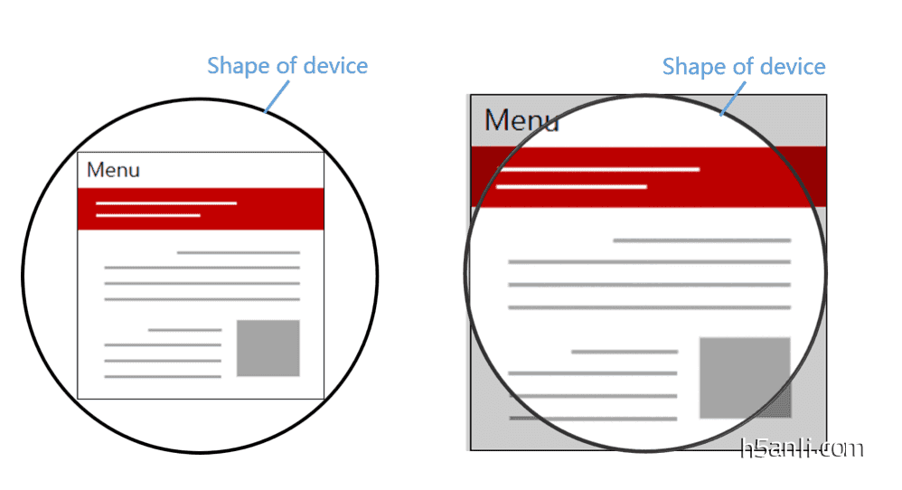
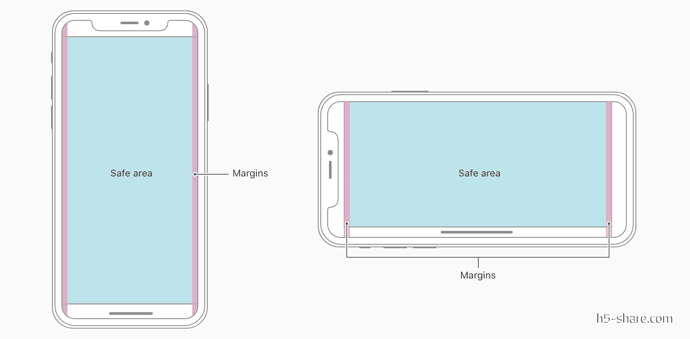

# CSS特性


## calc计算, var 
calc() 支持简单的 加减乘除.
var 获取css变量值, 定义时需要遵照命名规范

```css
        html:root {
            /*定义变量*/
            --background-color: #fafafa;
        }

        .container {
            width: 500px;
            height: 500px;
            border: 1px solid red;
        }

        .container .item {
            width: calc(100% / 2 );
            height: calc(100% / 2 );
            border: 1px solid green;

            /* 使用var 获取值 */
            background-color: var(--background-color); 
        }
```

## iphonex 适配问题
* [webkit官网文档](https://webkit.org/blog/7929/designing-websites-for-iphone-x/?hmsr=funteas.com&utm_medium=funteas.com&utm_source=funteas.com)

## 特殊设置(偷了人家的图片^_^)

iOS11 新增特性，苹果公司为了适配 iPhoneX 对现有 viewport meta 标签的一个扩展，添加了viewport-fit 用于设置网页在可视窗口的布局方式，可设置三个值：   
contain: 可视窗口完全包含网页内容（左图）   
cover：网页内容完全覆盖可视窗口（右图）<span style="color:red;">iphonex必须设置该值</span>    
auto：默认值，跟 contain 表现一致   


### CSS 的新增函数和预定义参数
constant 函数:   
iOS11 新增特性，Webkit 的一个 CSS 函数，用于设定安全区域与边界的距离，有四个预定义的变量：   
safe-area-inset-left：安全区域距离左边边界距离   
safe-area-inset-right：安全区域距离右边边界距离    
safe-area-inset-top：安全区域距离顶部边界距离   
safe-area-inset-bottom：安全区域距离底部边界距离   

env函数: iOS11之后          





### 安全区域



## 具体操作

### 必须设置的步骤

1.  设置 viewport-fit(必须的必)

```css
  <meta name="viewport" content="width=device-width, initial-scale=1.0, viewport-fit=cover"/>
```

2. 将内容设置到安全区域内，避免被小黑条子遮挡

```css
body {
    /*兼容写法*/
    padding-bottom: constant(safe-area-inset-bottom);
    padding-bottom: env(safe-area-inset-bottom);
}
```

### 底部固定导航的设置

### 完全贴底

```css
.nav-bottom {
    position: fixed;
    bottom: 0;
    ...

    padding-bottom: constant(safe-area-inset-bottom);
    padding-bottom: env(safe-area-inset-bottom);
}

或者
.nav-bottom {
{
  height: calc(60px(底部导航的高度 实际情况) + constant(safe-area-inset-bottom));
  height: calc(60px(实际情况) + env(safe-area-inset-bottom));
  /* 注意，这个方案需要吸底条必须是有背景色的，因为扩展的部分背景是跟随外容器的，否则出现镂空情况。 */
}

```

### 不完全贴底

```css
.nav-bottom {
    ...
    bottom: 0;
    margin-bottom: constant(safe-area-inset-bottom);
    margin-bottom: env(safe-area-inset-bottom);
}

或者
.nav-bottom {
  bottom: calc(50px(假设值) + constant(safe-area-inset-bottom));
  bottom: calc(50px(假设值) + env(safe-area-inset-bottom));
}

```


### 检测 iphonex

* 媒体查询方式 

```css
@media only screen and (device-width: 375px) and (device-height:812px) and (-webkit-device-pixel-radio: 3) {
    ...
}

```

* 语法支持

```css
@screen (padding-bottom: constant(safe-area-inset-bottom)) or   (padding-bottom: env(safe-area-inset-bottom)){
    ...
}
```

* js

```js
if(window.innnerWidth === 375 && window.innerHeight === 724 && window.devicePixelRatio === 3){
    ...
}
```

*  <span style="color:red">需要注意</span>

```
iphonex 参数 
屏幕宽度 375   高度 812
浏览器可视高度 724  顶部栏 88
底部安全距离 34

```


  
 


