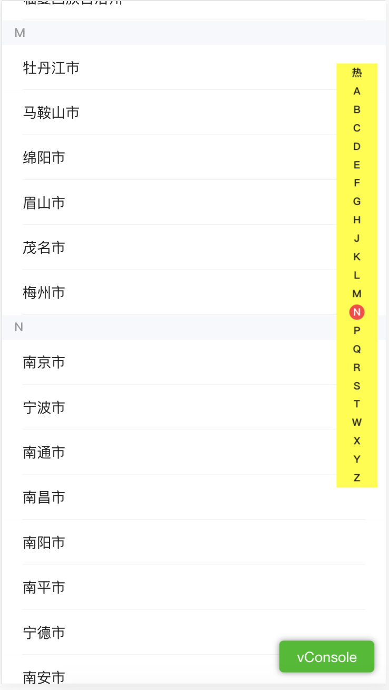

# base


## 1. visibilitychange  页面显示或隐藏时触发

```js

document.addEventListener("visibilitychange", function() {
  console.log( document.visibilityState ); //visible, hidden
});

```


## 2. 检测浏览器FPS

```js

    var lastTime = performance.now();
    var lastFameTime = performance.now();
    var frame = 0;

    var loop = function (time) {
      var now = performance.now();
      var fs = (now - lastFameTime);
      lastFameTime = now;
      var fps = Math.round(1000 / fs);
      frame++;


      //fps 越接近60, 越流畅
      console.log(fps);

      if (now > 1000 + lastTime) {
        var fps = Math.round((frame * 1000) / (now - lastTime));
        frame = 0;
        lastTime = now;
      };
      window.requestAnimationFrame(loop);
    };

```


## 3. MutationObserver 检测 dom的变化

```html
<body>

  <div id="test01">测试</div>
  <div id="test02">测试02</div>

  <button id="btn">点击</button>

  <script>

    var button = document.getElementById("btn");
    var targetNode01 = document.getElementById('test01');
    var targetNode02 = document.getElementById('test02');

    button.addEventListener('click', function(event){
      targetNode01.classList.add('class01');
      targetNode02.innerHTML =  "测试测试测试0000";
    });


    // Options for the observer (which mutations to observe)
    var config = {
      attributes: true,
      childList: true,
      subtree: true
    };

    // Callback function to execute when mutations are observed
    var callback = function (mutationsList) {

      console.log(mutationsList);
      
      for (var mutation of mutationsList) {
        if (mutation.type == 'childList') {
          console.log('A child node has been added or removed.');
        } else if (mutation.type == 'attributes') {
          console.log('The ' + mutation.attributeName + ' attribute was modified.');
        }
      }
    };

    // Create an observer instance linked to the callback function
    var observer = new MutationObserver(callback);

    // Start observing the target node for configured mutations
    observer.observe(targetNode01, config);
    
    observer.observe(targetNode02, config);

  </script>
</body>
```


## 4. IntersectionObseve 监听内容是否在可视区域
已城市列表选择功能为案例, [使用文档](https://developer.mozilla.org/en-US/docs/Web/API/IntersectionObserver)

滑动左侧城市， 右侧字母列表跟随滚动。
右侧字母列表滑动，左侧城市列表对应的滚动。




```js

    //获得需要监听的dom元素
    let lettersElem  = Array.from(document.querySelectorAll('.city-list'));
    let viewsID = new Set();


    //注册 监听的dom元素的触发的 回调函数
    var observe = new IntersectionObserver(function(entries) {

        entries.forEach(entry => {

          // 当元素出现在可视区域内
          if (entry.intersectionRatio > 0){
             viewsID.add(entry.target.children[0].id);
          } else {
          // 不再可视区内
            if (viewsID.has(entry.target.children[0].id)) {
              viewsID.delete(entry.target.children[0].id);
            }
          }
        });
  
        //将可视区域对应的首字母 标红, 即实现 滚动跟随功能
        let id = Array.from(viewsID)[0];
        $(".letter li a").removeClass('active');
        $(".letter li a[data-tap=" + id + "]").addClass('active');
        
    }, {
      threshold: [0, 0.25, 0.5, 0.75, 1] // 按照 0~1的几个点进行监听
    });   


    //将元素添加到 监听器中
    lettersElem.forEach(elem => {
      observe.observe(elem);
    });


    // 在城市字母上滑动时，停留到最后的城市
    let offsetTop;
    document.querySelector('.letter').addEventListener('touchstart', function(event){

      //阻止滚动穿透
      offsetTop =  $(window).scrollTop();
      $('body').addClass('no-scroll');
      $("body").css({
        top: -offsetTop + 'px'
      })
    }, true);


    //字母列表滑动结束
    document.querySelector('.letter').addEventListener('touchend', function(event){

      //回复body滚动
      $('body').removeClass('no-scroll');
      $(window).scrollTop(offsetTop);

      //找到touchend的最终停留的元素
      let curr = document.elementFromPoint(event.changedTouches[0].pageX, event.changedTouches[0].pageY);
      let $realElem;

      $(".letter a").removeClass('active');

      if (curr.nodeName.toLocaleLowerCase() == 'li') {
        $realElem = $(curr).find('a');
      } else if (curr.nodeName.toLocaleLowerCase() == 'a') {
        $realElem = $(curr);
      }


      //城市列表滚动到指定位置
      var offset = $('#' + $realElem.text() + '1').offset().top;
      window.scrollTo(0, offset);

    }, true);

```