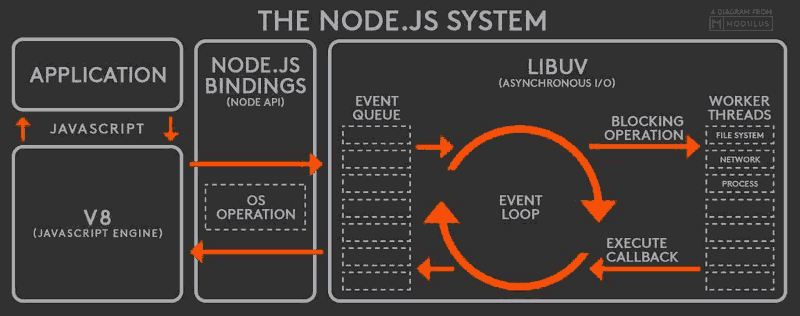

## event-loop 事件循环原理





```
node 的初始化

    初始化 node 环境。
    执行输入代码。
    执行 process.nextTick 回调。
    执行 microtasks。


进入 event-loop

    进入 timers 阶段

    检查 timer 队列是否有到期的 timer 回调，如果有，将到期的 timer 回调按照 timerId 升序执行。
    检查是否有 process.nextTick 任务，如果有，全部执行。
    检查是否有microtask，如果有，全部执行。
    退出该阶段。


    进入IO callbacks阶段。

    检查是否有 pending 的 I/O 回调。如果有，执行回调。如果没有，退出该阶段。
    检查是否有 process.nextTick 任务，如果有，全部执行。
    检查是否有microtask，如果有，全部执行。
    退出该阶段。


    进入 idle，prepare 阶段：

    这两个阶段与我们编程关系不大，暂且按下不表。


    进入 poll 阶段

    首先检查是否存在尚未完成的回调，如果存在，那么分两种情况。

    第一种情况：

    如果有可用回调（可用回调包含到期的定时器还有一些IO事件等），执行所有可用回调。
    检查是否有 process.nextTick 回调，如果有，全部执行。
    检查是否有 microtaks，如果有，全部执行。
    退出该阶段。


    第二种情况：

    如果没有可用回调。
    检查是否有 immediate 回调，如果有，退出 poll 阶段。如果没有，阻塞在此阶段，等待新的事件通知。


    如果不存在尚未完成的回调，退出poll阶段。


    进入 check 阶段。

    如果有immediate回调，则执行所有immediate回调。
    检查是否有 process.nextTick 回调，如果有，全部执行。
    检查是否有 microtaks，如果有，全部执行。
    退出 check 阶段


    进入 closing 阶段。

    如果有immediate回调，则执行所有immediate回调。
    检查是否有 process.nextTick 回调，如果有，全部执行。
    检查是否有 microtaks，如果有，全部执行。
    退出 closing 阶段


    检查是否有活跃的 handles（定时器、IO等事件句柄）。

    如果有，继续下一轮循环。
    如果没有，结束事件循环，退出程序。


在事件循环的每一个子阶段退出之前都会按顺序执行如下过程：

检查是否有 process.nextTick 回调，如果有，全部执行。
检查是否有 microtaks，如果有，全部执行。
退出当前阶段。
```
